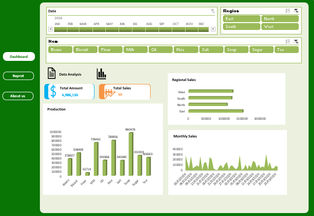

# 📊 Sales Dashboard Analysis (Microsoft Excel)

## 📌 Project Overview

This project is an interactive **Sales Dashboard** built entirely in **Microsoft Excel** to analyze sales performance across different regions, products, and time periods.

The dashboard enables users to filter data dynamically using slicers and instantly view key business metrics, making it easier to monitor performance and support data-driven decisions.

---

## 🎯 Objectives

- Analyze sales performance across multiple regions.
- Track total sales and revenue.
- Compare product performance.
- Monitor monthly sales trends.
- Provide an interactive reporting experience using Excel.

---

## 🛠️ Tools & Features Used

- Microsoft Excel
- Pivot Tables
- Pivot Charts
- Slicers
- Data Cleaning
- Data Modeling
- Conditional Formatting
- Dashboard Design

---

## 📈 Dashboard Features

### KPI Cards

- 💰 Total Amount
- 📦 Total Sales

### Interactive Filters

- Date
- Region
- Product Category

### Visualizations

- Regional Sales Comparison
- Monthly Sales Trend
- Product Performance Analysis

---

## 📊 Key Insights

- Regional sales performance can be compared instantly.
- Monthly trends help identify seasonal changes.
- Product analysis highlights top-performing products.
- Interactive filters allow users to drill down into specific regions, products, and time periods.

---

## 📂 Files Included

| File | Description |
|------|-------------|
| Sales Dashboard.xlsx | Excel dashboard |
| dashboard.png | Dashboard preview |
| README.md | Project documentation |

---

## 🚀 Skills Demonstrated

- Data Cleaning
- Data Analysis
- Excel Dashboard Design
- Pivot Tables
- Pivot Charts
- Data Visualization
- Business Reporting
- Interactive Reporting

---

## 📸 Dashboard Preview

